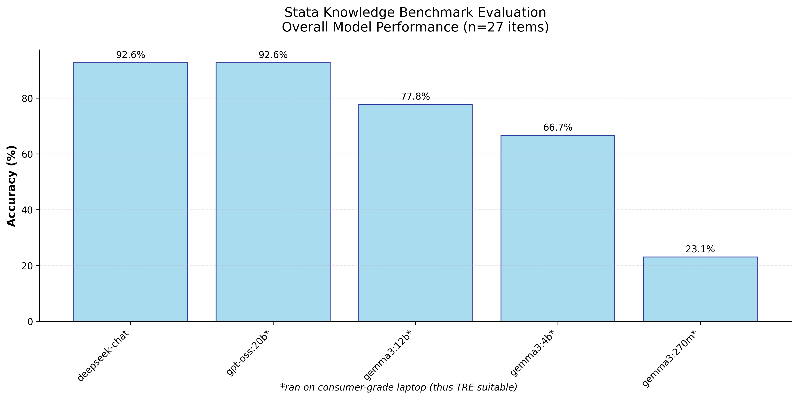

# Stata Knowledge Benchmark for Large Language Models (LLMs)

**An evaluation suite testing how well AI language models understand Stata statistical software**

> ⚠️ **Work in Progress**: This benchmark is a work-in-progress. Contributions welcome (see below).

## What is this?

This toolkit evaluates Large Language Models (LLMs) on their knowledge of Stata - a statistical software package widely used in economics, health research, and social sciences. The benchmark tests both **local models** (running on your computer) and **cloud-based models** (accessed via internet APIs).

## Why use this?

### 1. Understanding AI Performance on Statistical Software
- Measure how well different AI models understand Stata syntax and concepts
- Compare performance across different model sizes and providers
- Identify which domains (data management, analysis, visualization) AI handles best

### 2. Evaluating Local Models for Sensitive Data Analysis
- **Suitable for health datasets and confidential research**: Local models run entirely on your computer without internet connection
- **Trusted Research Environments (TRE) suitable**: No data ever leaves your secure environment
- **Privacy-first**: Analyze sensitive datasets (patient records, financial data, etc.) without cloud AI services
- **Cost-effective**: No per-query API charges for local models

## What you get

The benchmark tests 27 Stata knowledge areas including:
- **Do-file Syntax** - Basic Stata programming
- **Data Management** - Importing, merging, reshaping datasets
- **Statistical Analysis** - Regression, hypothesis testing, postestimation
- **Data Manipulation** - String functions, date variables, categorical data
- **Visualization** - Graph commands and customization

## Quick Start Guide

### Step 1: Install Requirements

```bash
# Install Python packages
pip install -r requirements.txt

# For local models: Install Ollama (recommended local LLM server)
# Visit: https://ollama.ai/download
```

### Step 2: Test a Local Model (No Internet Required)

```bash
# Download and test a local model (runs on your laptop)
ollama pull gemma2:9b
python3 run_benchmark.py --model_name "gemma2:9b" --temperature 0.1
```

### Step 3: Test a Cloud Model (Internet Required)

```bash
# First, add your API key to .env file
cp .env.example .env
# Edit .env and add: OPENAI_API_KEY=your_key_here

# Then test
python3 run_benchmark.py --model_name "gpt-4" --temperature 0.1
```

### Step 4: View Results

```bash
# Generate analysis plots and summary
python3 analyze_results.py
```

This creates professional charts showing:
- Overall model accuracy rankings
- Performance by Stata knowledge domain
- Temperature sensitivity analysis

## For Non-Technical Users

### What are "Local Models"?
- **Local models** run entirely on your computer (like Microsoft Word)
- **Cloud models** require internet and send your questions to remote servers (like Google Docs)
- For sensitive data analysis, local models are much safer

### What is "Temperature"?
- A setting controlling how creative vs. precise the AI is
- **Low temperature (0.1)**: More precise, consistent answers
- **High temperature (1.0)**: More creative, varied answers
- For technical questions like Stata, low temperature is usually better

### What Hardware Do I Need?
- **For small local models (270M-4B parameters)**: Any modern laptop
- **For large local models (12B+ parameters)**: 16GB+ RAM recommended
- **For cloud models**: Any computer with internet

## Example Results

Our initial evaluation shows promising performance from models that can run locally on consumer hardware:



*Initial results suggest that several local models achieve high performance on Stata knowledge tasks, potentially making them useful for sensitive data analysis in secure senvironments.*

After running the benchmark, you'll also see console output like:

```
======================================================================
STATA KNOWLEDGE BENCHMARK - EVALUATION RESULTS
======================================================================
Benchmark Items Evaluated: 27
LLMs Tested: 5

OVERALL ACCURACY BY MODEL:
----------------------------------------
deepseek-chat                    92.6% (25/27)
gpt-oss:20b*                     92.6% (25/27)  
gemma3:12b*                      77.8% (21/27)
gemma3:4b*                       66.7% (18/27)
gemma3:270m*                     23.1% (6/26)

* = Local model (runs on your laptop)
```

## Files in This Toolkit

| File | What it does |
|------|-------------|
| `run_benchmark.py` | Runs the Stata knowledge test on any LLM |
| `analyze_results.py` | Creates charts and analysis of results |
| `items.jsonl` | The 27 Stata test questions |
| `results/results.csv` | Raw test results (created automatically) |
| `results/plot_*.png` | Generated analysis charts |

## Command Reference

### Testing Models

```bash
# Test a local model
python3 run_benchmark.py --model_name "gemma2:9b" --temperature 0.1

# Test multiple temperatures
python3 run_benchmark.py --model_name "gemma2:9b" --temperature 0.1
python3 run_benchmark.py --model_name "gemma2:9b" --temperature 0.7

# Test with custom output file
python3 run_benchmark.py --model_name "gpt-4" --temperature 0.1 --output_file "my_results.csv"
```

### Generating Analysis

```bash
# Create all charts and summary (no options needed)
python3 analyze_results.py
```

## Supported Models

### Local Models (Privacy-Safe)
- **Gemma family**: `gemma2:2b`, `gemma2:9b`, `gemma2:27b`
- **Llama family**: `llama3:8b`, `llama3:70b`  
- **Qwen family**: `qwen2:7b`, `qwen2:72b`
- **Any Ollama-compatible model**

### Cloud Models (Internet Required)
- **OpenAI**: `gpt-4`, `gpt-4o`, `gpt-3.5-turbo`
- **Anthropic**: `claude-3-sonnet`, `claude-3-haiku`
- **DeepSeek**: `deepseek-chat`, `deepseek-coder`

## Troubleshooting

### "Model not found" error
- For local models: Ensure Ollama is running (`ollama serve`) and model is installed (`ollama pull model_name`)
- For cloud models: Check your API keys in the `.env` file

### "Permission denied" or network errors  
- For local models: Check if another program is using port 11434
- For cloud models: Verify internet connection and API key validity

### Python package errors
```bash
pip install pandas matplotlib seaborn python-dotenv requests
```

## Need Help?

1. **Check the example output** in this README
2. **Start with a small local model** like `gemma2:2b` to test your setup  
3. **Verify Ollama is running** with `ollama list` (for local models)
4. **Check your API keys** in `.env` file (for cloud models)

This benchmark helps researchers make informed decisions about which AI models are suitable for their Stata analysis needs, especially when working with sensitive data that requires local processing.

## Contributing

**Contributions are very welcome!** e.g., with:

- **Adding more Stata test questions** - Expand coverage of statistical methods, advanced features, or specialized domains
- **Testing additional models** - Try new local models or cloud APIs and share results
- **Improving analysis visualizations** - Enhance charts or add new analysis dimensions
- **Documentation improvements** - Help make this more accessible to researchers
- **Bug fixes and optimizations** - Code improvements and error handling

Contact david.bann@ucl.ac.uk or submit issues / pull requests 